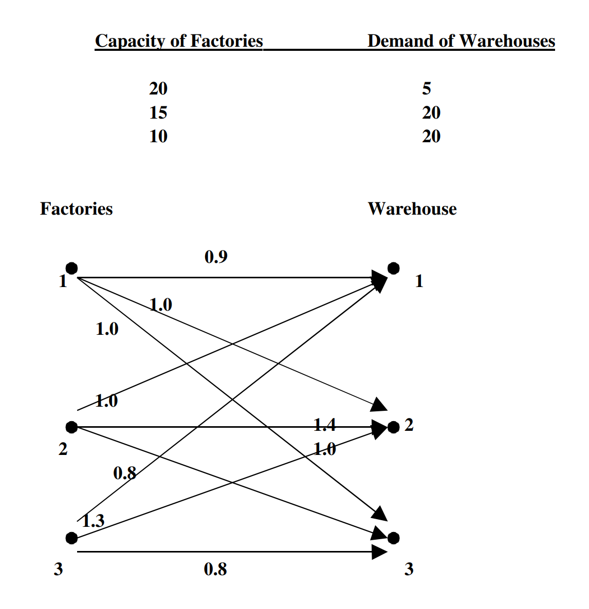

# Optimization
In this course we try to find the optimal solution for a discrete problem, for example traveling salesman, with a single optimization variable (i.e distance, time...)
## Phase I
Gives a starting solution. or an initial guess to a solution.

### Choose good or bad solution for phase I?
We should generally not choose a very good solution in phase I, because many optimization techniques will struggle to improve the solution at all. Remember we are usually only looking for an approximation of the optimal solution. Its better to choose a worse starting point, where the algorithm techniques are actually able to improve the solution.

## Phase II

Use phase I output as an input to an algorithm. Feed back solution recursively into the algorithm to improve the solution, hopefully finding the optimal solution.

## Application: Transportation Problem

> The general transportation problem is concerned with distributing amounts of any commodity from any group of 'sources' to any group of destinations or 'sinks'. The idea of commodity is general. The data for the problem can be arranged as a matrix of costs of transferring a unit quantity from source i to sink j; a vector which lists the quantities available at each source; and a vector of the demands at each sink. 

