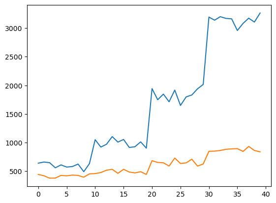

## TSP assignment

In this assignment I implement a few methods for getting initial and optimized solutions for the famous travelling salesman problem.


```python
import numpy as np
import time
import matplotlib.pyplot as plt
```


```python
def create_table(n, dist_min, dist_max):
    table = np.zeros((n, n))
    for i in range(an):
        for j in range(n):
            if i != j:
                dist = np.random.randint(dist_min, dist_max)
                table[i, j] = dist
                table[j, i] = dist
    return table

def get_cost(trip, table):
    cost = 0
    for i in range(len(trip)-1):
        dist = table[trip[i], trip[i+1]]
        cost += dist
    return cost


def random_solve_salesman(table):
    n = len(table)
    rand_trip = [-1]*(n+1)
    rand_trip[0] = np.random.randint(0, n)
    for i in range(len(rand_trip)-2):
        random_city = np.random.randint(0, n)
        while random_city in rand_trip:
            random_city = np.random.randint(0, n)
        rand_trip[i+1] = random_city
    rand_trip[-1] = rand_trip[0]
    return rand_trip

def greedy_solve_salesman(table):
    n = len(table)
    greedy_trip = [-1]*(n+1)
    greedy_trip[0] = np.random.randint(0, n)

    for i in range(len(greedy_trip)-2):
        current_city = greedy_trip[i]
        closest_distance = np.inf
        for trial_city in range(0, n):
            dist = table[current_city, trial_city]
            if (dist < closest_distance) and trial_city not in greedy_trip:
                closest_distance = dist
                closest_city = trial_city
        greedy_trip[i+1] = closest_city 

    greedy_trip[-1] = greedy_trip[0]
    return greedy_trip

def greedy_opt_trip(trip, table, n_opt):
    n = len(table)
    opt_trip = trip.copy()
    current_cost = get_cost(opt_trip, table)

    for i in range(n_opt):
        c1_idx = np.random.randint(1, n)
        c2_idx = np.random.randint(1, n)
        c1 = opt_trip[c1_idx]
        c2 = opt_trip[c2_idx]

        trial_trip = opt_trip.copy()
        trial_trip[c1_idx], trial_trip[c2_idx] = c2, c1
        trial_cost = get_cost(trial_trip, table)
        if trial_cost < current_cost:
            opt_trip = trial_trip
            current_cost = trial_cost
    return opt_trip
```

### Program structure

To evaluate the performance of the different methods, we run the algorithms on a TSP of 50, 100, 250 and 500 cities.
Bounds are set on the min and max distance between cities and a table of the city distances (matrix representation of the undirected graph) is generated randomly.
We run the optimization algorithms 10 times for each city count to improve our evaluation accuracy, since there's uncertainty and we also want to inspect the reliability/variance of our optimization algorithms.

#### Initial solutions
The initial solutions are generated with two different methods, a random and a greedy method. A TSP solution is represented as a list/array of numbers, showing the order of cities to visit. To evaluate the cost of a solution, we simply iterate through the solution and look up the distances between the cities which are added to a total solution cost.

The random solutions are generated by simply picking random city numbers not already in the trip, until the trip is complete.

The greedy solver first picks a random starting city. Then, it loops through all non-visited cities to find the one that is the closest to the current city. This process is repeated until all cities have been visited. This is a greedy algorithm, because it forms the solution "as it goes", only picking the destinations that are *locally* optimal, in that they are the closest to the current city. It is a simple, deterministic algorithm that provides a starting solution, which is *usually* much lower cost than the random solution. However, this may not be desirable, since a very good initial solution can hinder our later optimization.

#### Optimization

After the initial solutions have been generated, an optimization strategy is used to modify them to reduce the trip costs. The optimization algorithm works as follows:
- The cost of the input solution is calculated
- Loop for n iterations (1'000'000 here):
    - pick two random cities in the current solution and swap their positions
    - calculate the cost of the new trip
    - if the cost decreased, keep the new trip. Otherwise, discard the swap.
    - repeat the loop
     


```python
n_list = (50, 100, 250, 500)
dist_min = 1
dist_max = 100

result_opt_rand = []
result_opt_greedy = []

for n_cities in n_list:
    table = create_table(n_cities, dist_min, dist_max)
    for i in range(10):
        rand_trip = random_solve_salesman(table)
        greedy_trip = greedy_solve_salesman(table)
        
        opt_rand_trip = greedy_opt_trip(rand_trip, table, 1_000_000)
        opt_greedy_trip = greedy_opt_trip(greedy_trip, table, 1_000_000)
        result_opt_rand.append(get_cost(opt_rand_trip, table))
        result_opt_greedy.append(get_cost(opt_greedy_trip, table))
    print(f"calculated 10 results for n = {n_cities}")
```

    calculated 10 results for n = 50
    calculated 10 results for n = 100
    calculated 10 results for n = 250
    calculated 10 results for n = 500
    


```python
plt.plot(result_opt_rand)
plt.plot(result_opt_greedy)
```


    [<matplotlib.lines.Line2D at 0x1f086af60a0>]


    

    


#### Results
The plot shows the result of optimizing the initial random trip in blue, and optimizing the initial greedy trip in orange. The x-axis is the trip and the y-axis shows the cost of the trip. Since we can the algorithm 10 times on each number of cities in (50, 100, 250, 500) there are 40 total trips in the plot.

It is clear that the optimized greedy trips are much better than the optimized random trips. My hypothesis is that the optimization strategy we are using is just not efficient enough to improve on the initial greedy solution without an extreme number of tries, which would take very long to test in my implementation, where i have set the iteration count to 1'000'000 (number of test swaps). My implementation is slow and python is a poor choice of language performance wise for this.

Another point is that I am generating the cities randomly, and i think the distances generated are based on a normal distribution. The nature of the distribution of city lengths could change the performance of particular strategies, but I'm not sure exactly how this plays out here. For a better evaluation of the method the program should be optimized more to allow for a much larger number of optimization iterations and a more varied problem set.
